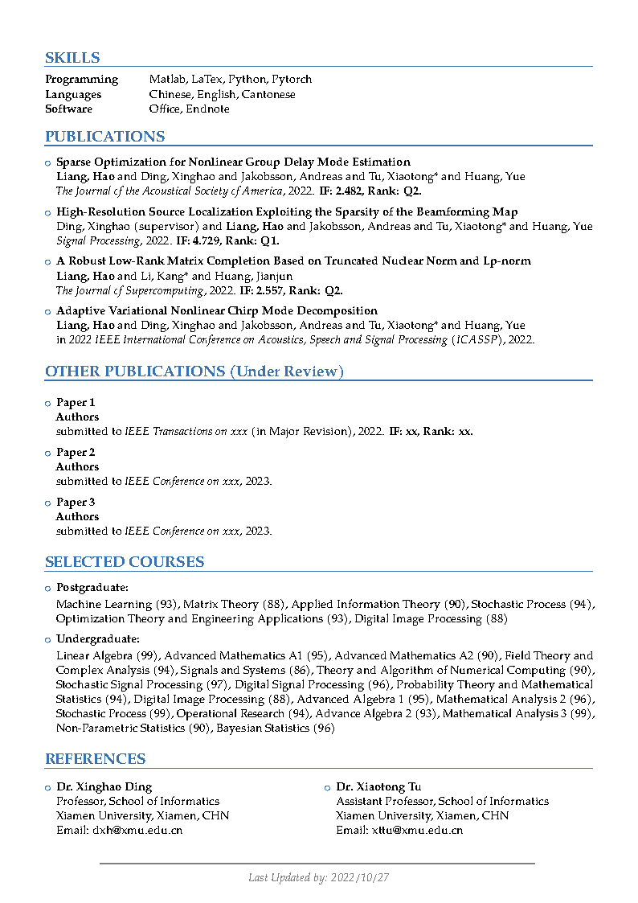
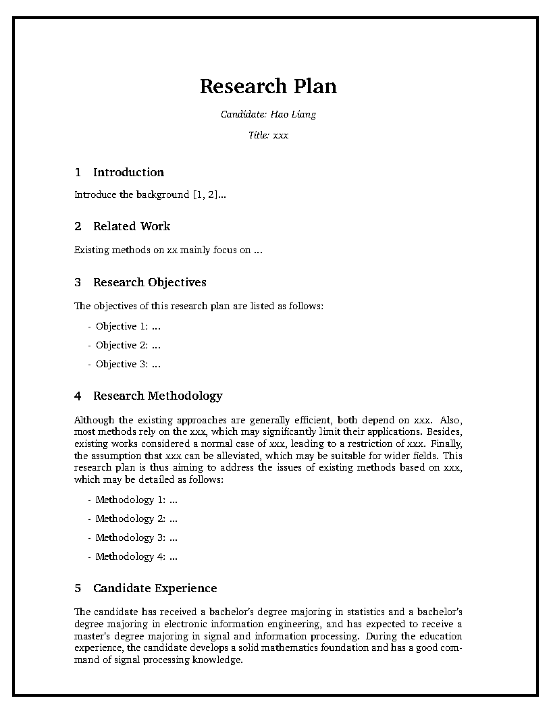
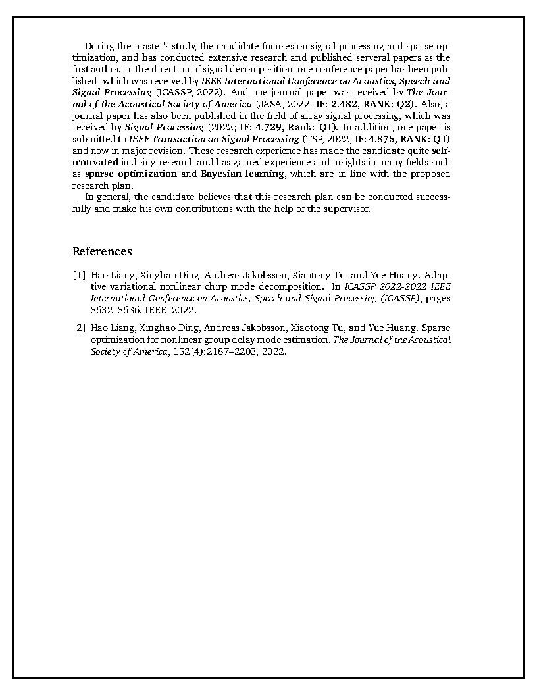
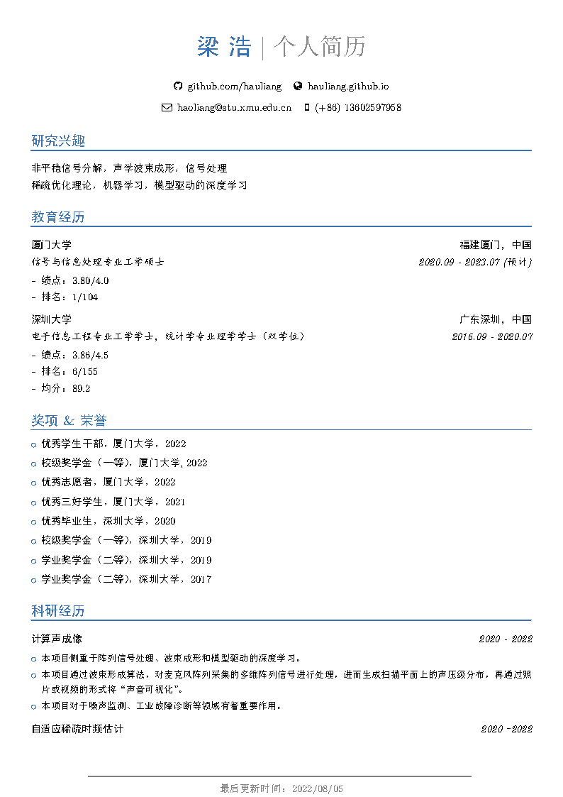
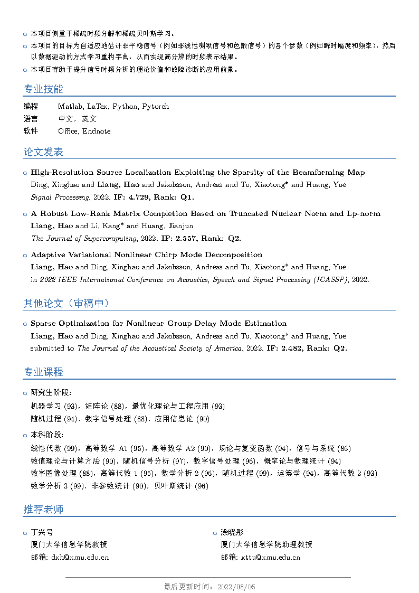

# PhD-Application-Template

Template Preview
----------

The LaTex template for my PhD application, including CV and RP.

CV Preview
----------
 

RP Preview
----------
 

CV (CN) Preview
----------
 

The CV template is based on the codes available from https://www.overleaf.com/articles/montasirs-complete-cv/nrzhncvnktzd, and the RP template is based on the codes available from https://www.overleaf.com/latex/templates/environmental-studies/kspbxfdkfnrc.

Please check the accompanying license before using.

@ All rights are reserved by the authors.
